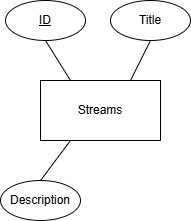
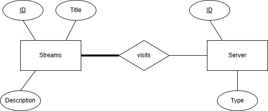
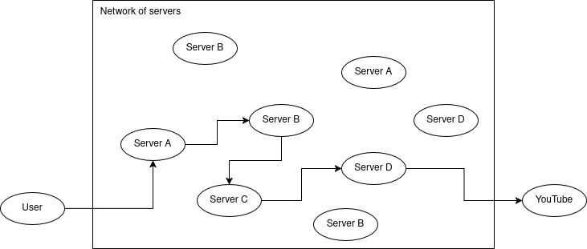
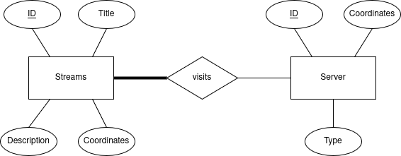

# LiveGuard Summer 2025 Internship Assessment

## Overview (READ THIS FIRST)
The goal of this assessment is to evaluate your ability to design and implement a small REST API with a database. The application is split in 3 iterations, to simulate real life updates to a task. In the spirit of this, try to work on each iteration without looking at the next one(s).

## Submission
To begin, fork this repository and **make your fork private**. Once completed, submit the GitHub repository link along with a brief description of your approach.

**Make sure to have commits named "Iteration X", for each iteration you complete (X=1,2,3).** Of course, you can (and are encouraged to) commit your progress between these, but we will use these specific commits to see your "final result" for each iteration.

Good luck!

      

## Iteration 1: Live Stream Database

### Entities

- **Live Streams**:
  - `id` (unique identifier)
  - `title` (string)
  - `description` (string)

### Business Requirements
You will build a REST API in your language of choice that allows users to create and manage live streams. The API should:
1. Allow the creation of livestreams, where:
   - The user provides stream details (title, description).
   - The livestream is stored in the database
   - The API backend returns the livestream details.
2. Provide an endpoint to retrieve all existing livestreams.
3. Allow data persistence using a database.

### Technical Requirements
- Use a REST API framework of your choice in the language you are most comfortable with.
- Use a relational (PostgreSQL, MySQL, SQLite, etc) or graph database (Neo4j).
- Expose the following API endpoints:
  - `POST /streams` → Create a new livestream.
  - `GET /streams` → Retrieve a list of all livestreams.

      

## Iteration 2: Server Database

### Entities

- **Live Streams**:
  - `id` (unique identifier)
  - `title` (string)
  - `description` (string)
  - A many to many relationship with processing server nodes 
- **Processing Servers**:
  - `id` (unique identifier)
  - `type` (A, B, C, or D)

### Business Requirements

Update your REST API to add processing server selection. The API should:
1. Allow the registration of processing servers with a type (A, B, C, D).
2. Allow the creation of livestreams, where:
   - The user provides stream details (title, description) *(same as Iteration 1)*.
   - The API backend selects a set of 4 processing servers (one of each type A, B, C, D). You can pick any 4 servers, as long as there is one of each type.
   - The selected servers are stored in the database along with the livestream.
   - The API backend returns the livestream details *(same as Iteration 1)*.
3. Allow the retrieval of the assigned processing servers for a given livestream.
4. Provide an endpoint to retrieve all existing livestreams *(same as Iteration 1)*.
5. Allow data persistence using a database.

### Technical Requirements
Update your API to have the following endpoints:
- `POST /servers` → Register a new processing server.
- `POST /streams` → Create a new livestream, assigning the set of processing servers.
- `GET /streams` → Retrieve a list of all livestreams.
- `GET /streams/{stream_id}/servers` → Retrieve the processing servers assigned to a given livestream, using its ID.

      

## Iteration 3: Optimal Server Selection

### Entities

- **Live Streams**:
  - `id` (unique identifier)
  - `title` (string)
  - `description` (string)
  - `coordinates` (x, y as floats, where the stream originates)
  - A many to many relationship with processing server nodes 
- **Processing Servers**:
  - `id` (unique identifier)
  - `coordinates` (x, y as floats, where the server is located)
  - `type` (A, B, C, or D)

**The latency between any two servers is defined as the Euclidean distance between their coordinates.**

### Business Requirements

Update your REST API to add optimal server selection. The API should:
1. Allow the registration of processing servers with coordinates and a type (A, B, C, D) *(same as Iteration 2)*.
2. Allow the creation of livestreams, where:
   - The user provides stream details (title, description) and starting coordinates (you can think of it as the geographical location of the user).
   - The API backend selects an optimal set of processing servers (one of each type A, B, C, D) to minimize latency. You need to figure out an algorithm to achieve that.
   - The selected servers are stored in the database along with the livestream.
   - The API backend returns the livestream details along with the total latency.
3. Allow the retrieval of the assigned processing servers for a given livestream *(same as Iteration 2)*.
5. Provide an endpoint to retrieve all existing livestreams *(same as Iteration 2)*.
6. Allow data persistence using a database.

### Technical Requirements
Update your API to have the following endpoints:
- `POST /servers` → Register a new processing server.
- `POST /streams` → Create a new livestream, assigning an optimal set of processing servers.
- `GET /streams` → Retrieve a list of all livestreams.
- `GET /streams/{id}/servers` → Retrieve the processing servers assigned to a given livestream.

## Bonus Points
- Implement Docker Compose to run the application and database in containers.
- Proper usage of Git with clean commits and good usage of issues.
